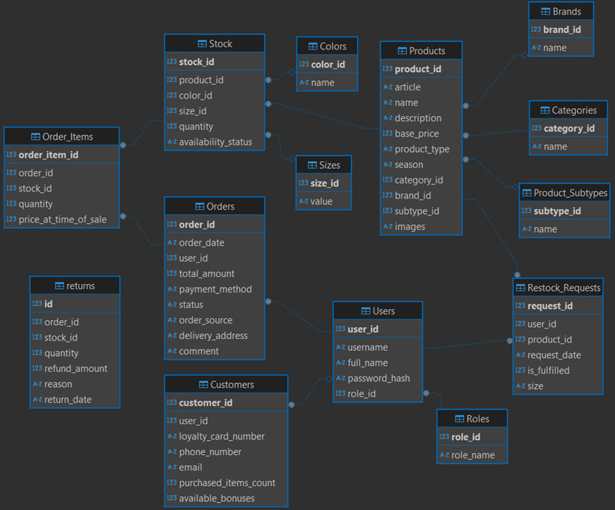
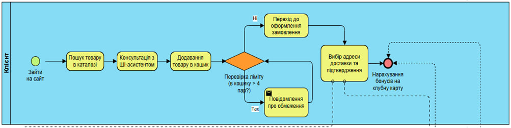
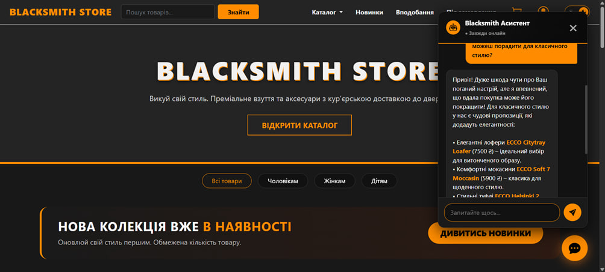
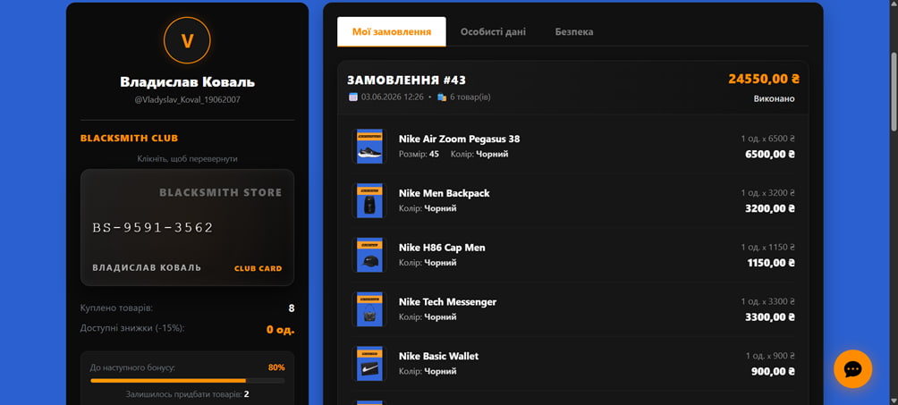
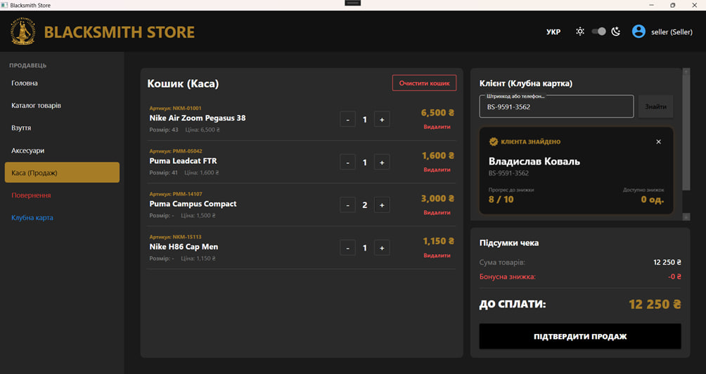
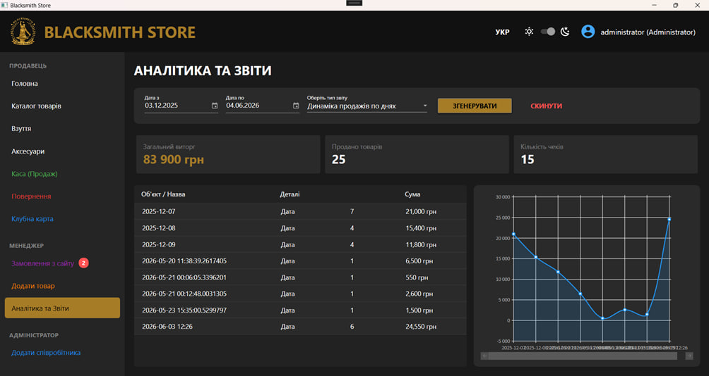

# 👞 Shoe-and-Accessories-Store-Inventory-System

<div align="left">
  
  
  
  
  
  
</div>

<br>

A comprehensive, dual-platform retail management ecosystem designed to automate business processes for the **"Blacksmith Store"** shoe and accessories brand. This project bridges the gap between physical retail and e-commerce by providing a fast **WPF desktop application** for offline staff and a responsive **ASP.NET Core MVC web application** for online customers, both synchronized in real-time via a unified **SQLite** database.

## 🚀 Key Features

### 🖥️ For Staff (WPF Desktop Application)

Designed for speed and reliability at the physical Point of Sale (POS) and back-office:

* **Barcode Scanner Integration:** Instant product identification and automated cart calculation for lightning-fast checkouts.
* **Role-Based Access Control:** Distinct functional modules for Sellers (POS, Returns), Managers (Inventory, Online Order Fulfillment), and Administrators (Staff Management, Financial Analytics).
* **Automated MS Word Reporting:** One-click generation of beautifully formatted `.docx` financial and sales reports via MS Office Interop.
* **Low-Stock Alerts:** Dynamic visual indicators for items dropping below threshold limits.

### 🌐 For Customers (ASP.NET Core Web Application)

A premium digital storefront designed with modern UI/UX principles (Dark/Light themes):

* **AI-Powered Virtual Assistant:** Integrated **Google Gemini API** acting as a 24/7 consultant, providing personalized shoe recommendations in Ukrainian.
* **Advanced E-Commerce Capabilities:** Multi-parameter filtering (size, season, brand, color), dynamic cart, and order placement.
* **"Try-at-Home" Delivery Logic:** Custom business rule restricting orders to a maximum of 4 pairs of shoes for local courier fitting.
* **"Blacksmith Club" Loyalty Program:** A virtual 3D loyalty card with automated progress tracking (15% discount coupon generated every 10 items purchased).
* **Automated Email Notifications:** Restock alerts and order status updates sent directly to users.

## 🏗️ Architecture & Database

The system enforces a strict separation of concerns, utilizing **MVC** for the web application and a layered architecture for the WPF app.

* **Unified Database:** A relational **SQLite** database containing 14 normalized tables (`Products`, `Stock`, `Orders`, `Customers`, etc.) managed via **Entity Framework Core** for the web and `System.Data.SQLite` for the desktop.
* **Transaction Safety:** Order checkouts feature full database transaction rollback mechanics to prevent inventory desynchronization.

<details>
<summary><b>📂 Click to view Database Schema & BPMN Models</b></summary>

### Relational Database Schema



### Business Process Model (Online Order Flow)



</details>

## 📸 Application Showcase

### Customer Web Experience & AI Assistant



### Personal Loyalty Cabinet (Web)



### Seller POS System with Barcode Support (WPF)



### Admin Financial Dashboard (WPF)



## ⚙️ How to Run Locally

### Prerequisites

* **Windows OS** (required for WPF application)
* **Visual Studio 2022** with .NET 8.0 Desktop & Web development workloads.

### Configuration & Security Note

> 🔒 **Security Notice:** For security reasons and to prevent email/API abuse, the `Google Gemini API Key` and `SMTP Email Password` have been removed from the public repository. To test AI chat and email features, please insert your own API keys into the respective configuration files or service classes.

### Installation

1. Clone the repository:

```bash
git clone https://github.com/VladyslavKoval999/Shoe-and-Accessories-Store-Inventory-System.git
```

2. Open `BlacksmithStore.sln` in Visual Studio 2022.

3. Restore NuGet packages for both projects.

4. To run the Web App:

   * Set `BlacksmithStoreWeb` as the startup project.
   * Run via IIS Express or Kestrel.

5. To run the POS App:

   * Set `BlacksmithStore` as the startup project.
   * Press `F5`.

### Test Credentials (WPF Application)

* **Role:** Administrator
* **Login:** VLADadmin
* **Password:** 1-_aD!.min-)V1ad4,s

## 👨‍💻 Author

**Vladyslav Koval** — *Junior Software Developer*

[LinkedIn Profile](https://linkedin.com/in/vladyslav-koval2007)
